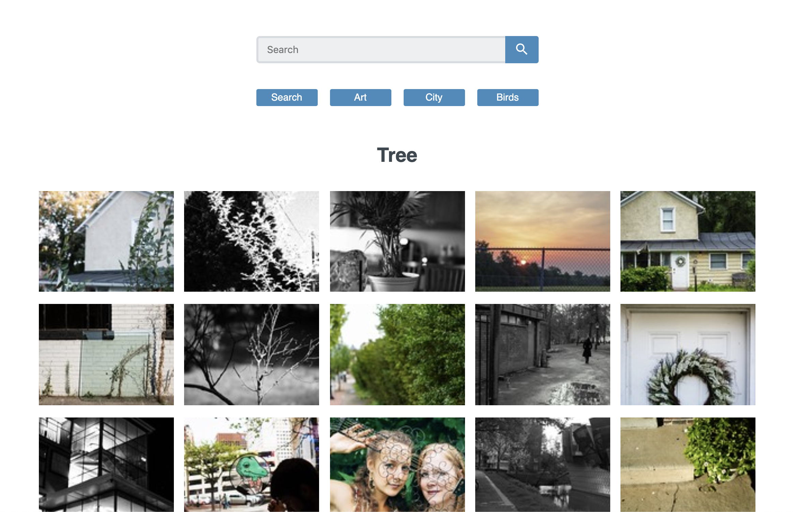

### React Photo Gallery



&nbsp;
&nbsp;
&nbsp;

A React app that shows you photos fetched from Flickr.

#### Config file
Add a `config.js` file to `src` with your API key:

```
const apiKey = "YOUR-API-KEY";
export default apiKey;
```

#### Running
* `npm install`
* `npm start`
